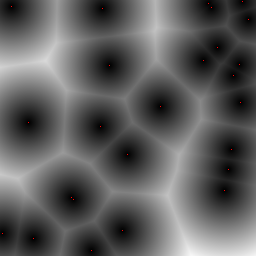

# Challenge #101 - Cellular Textures

Cellular textures are intrinsically linked to voronoi diagrams, and it's used in Worley noise, which is pretty much the basis of how I went about this. 

I followed what is outlined on [this wikipedia page](https://en.wikipedia.org/wiki/Worley_noise), which goes something like this:
1. Randomly distribute feature points in space
2. Extract the distances from the given location to the nth-closest point.
We then use the distances as color values for noise

Here is an example output of my program, where the red dots represent the feature points:\

